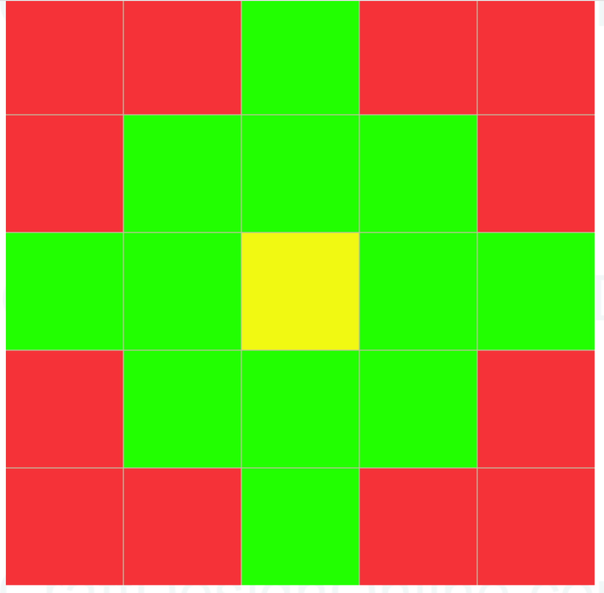
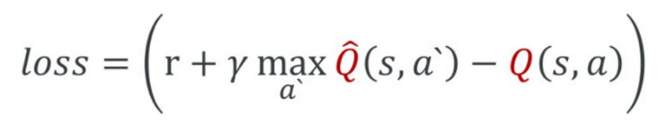
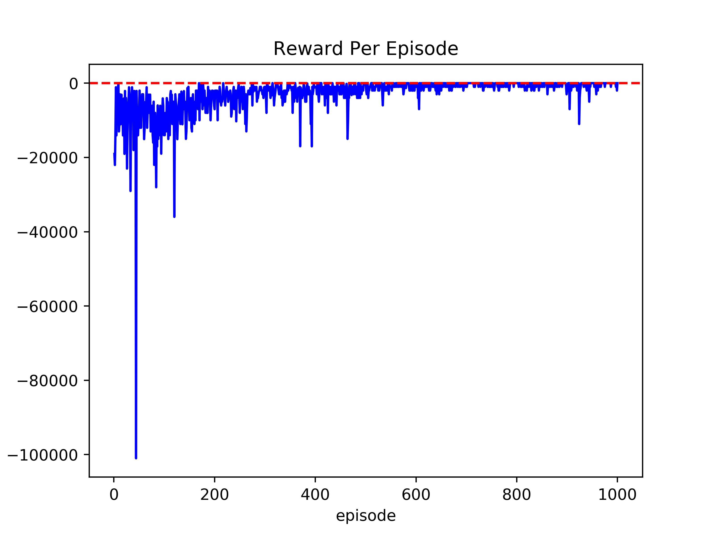
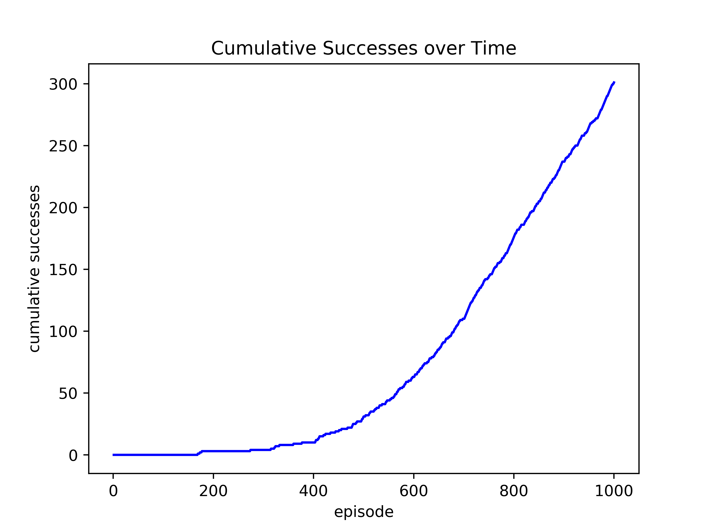

## Video
[](https://www.youtube.com/watch?v=q6b0i-oiVos)

## Summary
For our project, we wanted our agent to find the most optimal path down a given hill while taking minimal fall damage. Some of the hills we trained our agent on, were actual hills found in randomly generated Minecraft worlds while others were generated by us (spirals, "3d Gaussian Distribution" hills) to test our agent's ability. In Minecraft, a player would take damage if the player attempted to fall more than 3 blocks; our agent follows the same rules as a normal survival player. Every time our agent takes damage, it gets penalized (we give our agent a negative reward). If it manages to take a step down the hill without taking damage, we give it a positive reward. Our agent keeps making moves until it has either taken 100 steps or the agent reached the bottom of the hill.

The biggest challenge for us was training our agent. For each hill, our agent would need to run for a few hundred episodes. Often times, we would have to run our model overnight because our laptops became unusable when we were training our model. If we ever had a bug in our code, we would not find until deep into our training process, so fixing errors was very time-consuming.

## Approaches
### Proposed Approaches
In this project, we thought of many possible approaches to solve our descent problem. The first idea proposed was to just used Dijkstra's with the relative change in heights being the edge weights. While it would give use the optimal route to take the least amount of damage, that approach would require the knowledge of the entire environment. For our project, we wanted to keep it realistic and limit the sight of the agent to a 5x5 grid around it; normal Minecraft players only have a limited field-of-view.

The next idea proposed was to use q-learning to solve our descent problem, but we realized that it would take far too long to train. Recall that in Assignment 2, students ran such a simple problem for thousands of iterations but still did not converge. We believed that such a complicated problem with complicated structures for the agent to climb down, training the agent using q-learning would not be able to converge within a reasonable amount of time.

### Our Approach
Our final idea, which we used for this project, was deep-q-learning. It uses a neural network in order approximate q-values for each possible action given a state. It is far more effective in larger environments and non-discrete states compared to q-learning. 

The agent’s state is an area around its current position in a grid of heights of the terrain relative to the agent’s height. Our agent has the ability to see the heights of the blocks which it can move to in two moves. As you can see in the grid below, the agent is located in the yellow square. The agent has the ability to see all of the relative heights of the green squares. All the red squares are locations which the agent cannot reach in two moves, so we remove them from our input to the model.



The agent has 4 different move actions it could take: north, east, south, west. It could also jump in those directions if the terrain in the specific cardinal direction is only 1 block higher than the agent’s current y position but is still encompassed in those 4 actions. 

Note: the agent is not memorizing the entire hill or a specific path; it is just trying to learn which direction to move in based on the relative heights of the terrain.

#### Reward Function
The agent’s reward function is the following:
```
If agent keeps the exact same position:
	Reward = -1000
Otherwise:
	Reward = 2 * change in y position - 50 * damage taken - 1
```
This reward function penalizes the agent for taking damage and rewards them for the more downhill movement made without taking damage. The reward for each episode is used to train a neural network model to develop a Markov Decision Process (MDP), which can predict the agent’s reward for taking a specific action. The neural network is trained by the following loss function:



The variables of this function are as follows:
  - r is the return of the reward function mentioned previously
  - γ is the discount factor, which tells the MDP how much to value new information it learns
  - Q is the value of the state being updated within the neural network
  - s is the state and a is the action

#### Hyperparameters
The agent had an constant learning rate of 0.1. We didn’t want the learning rate too low or the agent would take too long to train; we didn’t want the learning rate too high or performance may diverge. Also, the agent had a discount rate of 0.95 because we didn’t want our agent to be too short-sighted. Finally, the agent starts off an epsilon, which is the chance the agent takes a random action, of 1.0, but its epsilon gradually decreases multiplicatively by 0.9999. Over time, the chance the agent takes a random action decays, and the agent starts acting by taking the best rewarded action. 

## Evaluation
We measured our agent using two main metrics:
 - Rewards per episode
 - Moves per episode
 
We calculated rewards per episode by adding up all the rewards for every move made during that episode and the moves per episode is self-explanatory. We tested the agent we created on a real, randomly-generated Minecraft hill that includes small cliffs, plateas, ditches, etc. Below is the recorded the moves that the agent made during the training on that hill (he red "x" is the start point of the agent, and the black dot is the agent).

| Beginning of Training | Middle of Training | End of Training |
| --------------------- | ------------------ | --------------- |
|  |  |  |

As stated in the "Approaches" section of this report, the agent starts off with an epsilon of 1.0, so the agent takes random actions for virtually every move (as demonstrated by the gif of the agent's movements at the beginning of training). After around 200 episodes, although the agent is still taking mostly random actions, epsilon has partially decayed, and the agent has a good understanding of the rules of fall damage. As demonstrated in the gif of the agent's movements in the middle of training, the agent's movements are more controlled and seemingly converges to the safest path. At nearly a thousand episodes, the epsilon reaches its minimun, and the agent is fully trained. As demonstrated in the gif of the agent's movements at the end of training, the agent will always at the optimal path to the bottom.

We also recorded and graphed the results of that training. Below is a graph of rewards per episode.



As you can see, the beginning of the graph seems very erratic and the rewards per episode are very negative, up to -100000. This is mainly because the agent has such a high epsilon in the beginning of the training; it would take a random action for virtually every move. However, as the agent gets trained, the epsilon gets lowered and the agent learns how to act in specific situations. By around episode 600, the agent basically understands the "rules of Minecraft," masters the hill's obstacles (plateas, ditches, cliffs, etc.), and can traverse it almost perfectly without taking any negative reward penalties at all.

Below is a graph of the moves per episode.


As you can see, the beginning of the graph seems very erratic and the moves per episode seems to always reach our maximum moves limit of 100. The reason the agent seems so stagnant in the beginning is because the agent has such a high epsilon in the beginning of the training; as stated above, it would take a random action for virtually every move. Along with this, the agent at the beginning gets stuck on the plateau at the top of the hill for many of the episodes. By episode 800, the agent reaches the optimal number of moves to the bottom of the hill.

Below is a graph of cumulative successes.



Using the rewards per episode metric, we gauged whether the agent succeeded or not based on whether or not the reward for that specific episode is positive. As stated before, the agent takes a random action for virtually every move at the beginning, so there’s a low probability of the agent succeeding. However, after episode 600, once it the agent learns what to do in certain situations (plateas, ditches, cliffs, etc.), the agents succeeds for almost every episode afterwards; the line for the the cumulative successes becomes a straight line.

In conclusion, our agent exceeds our expectations, and we consider it successful in performing its task of descending down a hill while taking minimal fall damage.

## References
We used the following python libraries in implementing the deep Q-learning algorithm, in addition to Malmo: 
  - keras
  - tensorflow 
  - numpy
  
The following articles assisted in our design: 
  - [Deep Q-learning Reference](https://keon.io/deep-q-learning/?fbclid=IwAR2WyQjJg7nFgQeF_p72_Bt8FSkGCc4ZhJqcRipT2cmnb6MtbYu-mA7bTT0)
  - [Malmo's Documentation](http://microsoft.github.io/malmo/0.30.0/Documentation/index.html)
