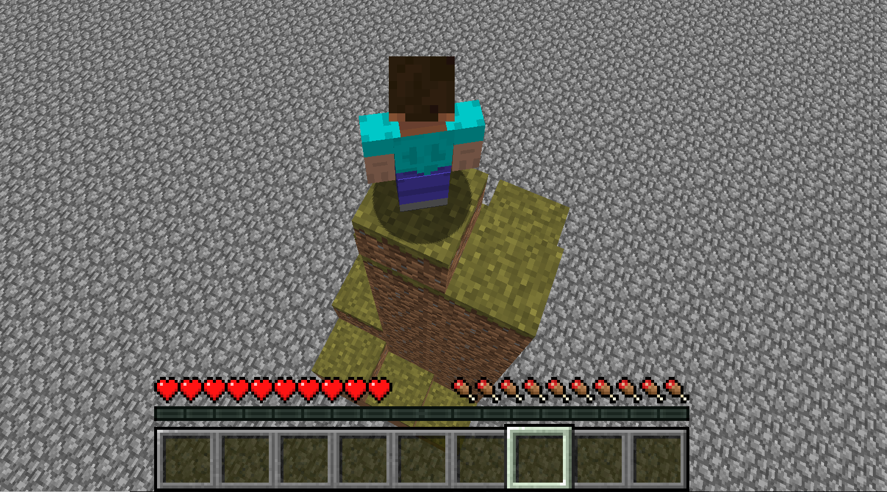

# Descendent

[Github Repository](https://github.com/JasonMehroziad/Descendant)

# Introduction

Descendent is an intelligent downhill climbing bot. Its goal is to reach the bottom of a hazardous structure efficiently while taking minimal damage. Through deep Q-learning, Descendent is able to conquer great heights and obstacles. As the project progresses, Descendent will be tasked with descending even larger and more dangerous structures, and its training code will advance and become more complex. On completion, this AI will fear no descent.

Reports:

- [Proposal](proposal.html)
- [Status](status.html)
- [Final](final.html)
